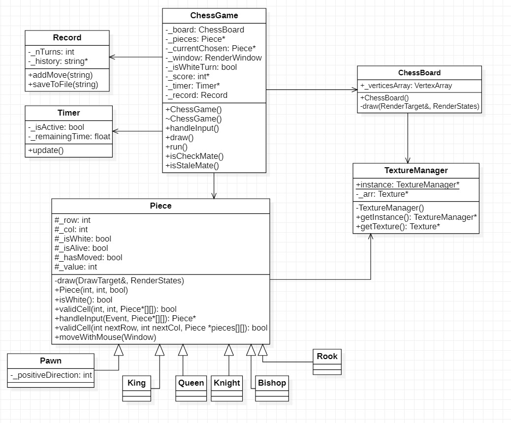

# Đồ án cuối kỳ OOP

## Mục tiêu

Cài đặt một trò chơi cờ vua. Hỗ trợ một số tính năng cơ bản như sau:

- Tổ chức một ván cờ vua theo luật tiêu chuẩn.
- Tính giờ lượt của người chơi.
- Ghi lại, lưu và tải một trận đấu.

## Thư viện ngoài (External library)

Chương trình được viết sử dụng `Simple Fast Multimedia Library`. Hỗ trợ các thư viện liên quan đến xử lý đồ họa, âm thanh.

Các kỹ thuật của SFML sử dụng trong đồ án này được đề cập ở các hướng dẫn sau: [1](https://www.sfml-dev.org/tutorials/2.5/graphics-sprite.php), [2](https://www.sfml-dev.org/tutorials/2.1/graphics-vertex-array.php#top).

## Các mẫu thiết kế được sử dụng

Để giải quyết các vấn đề xuất hiện trong quá trình thiết kế và cài đặt trò chơi, các mẫu thiết kế sau đã được sử dụng:

- `Flyweight`: Hầu hết các quân cờ đều có ít nhất 2 bản thể. Để tiết kiệm bộ nhớ và chi phí thực thi của CPU, các quân cờ giống nhau sẽ dùng trong một texture - Đây là trạng thái nội tại (intrisic states) của các quân cờ. Các thuộc tính khác như vị trí là trạng thái bên (extrinsic states) ngoài của chúng.

- `Singleton`: Để phân phối texture khi một lớp yêu cầu, một thực thể `TextureManager` sẽ được dùng để trả về một texture khi được yêu cầu. Mỗi texture sẽ được tải lên bộ nhớ 1 lần.

## Các lớp được sử dụng

### Piece

Đây là đối tượng quân cờ, kế thừa 2 lớp `sf::Drawable` và `sf::Transformable`, gồm một số đặc tính cơ bản sau:

- `int _row, _col`: Tọa độ (Chỉ số dòng và cột) của quân cờ hiện tại.
- `bool _isWhite`: Để chỉ đây là quân cờ của bên trắng hay bên đen.
- `bool _isAlive`: Để chỉ quân cờ này đã bị quân của đối phương ăn hay chưa.
- `bool _hasMove`: Để chỉ quân cờ này đã di chuyển hay chưa (Một số nước đi quan tâm đến việc người chơi đã di chuyển quân cờ hay chưa, chẳng hạn nhập thành)
- `int _value`: Giá trị mà đối phương sẽ nhận được khi ăn quân cờ này (Tốt = 1, Mã = 3, Tượng = 3, Xe = 5, Hậu = 9, Vua = `INF`).
- `sf::Sprite _sprite`: Sprite của quân cờ như đã được mô tả ở mục trước.

Lớp này sẽ bao gồm các hàm chức năng sau:

- `Piece(int row, int col = 0, bool isWhite = true)`: Hàm tạo một quân cờ.
- `virtual void draw(sf::RederTarget& target, sf::RenderStates states)`: Hàm ảo kế thừa từ lớp `sf::Drawable` và `sf::Transformable`.
- `virtual bool validCell(int nextRow, int nextCol, Piece *pieces[][])`: Hàm nhận vào tọa độ đích và trạng thái của bàn cờ. Kết quả trả về cho biết quân cờ hiện tại có được phép di chuyển vào ô ở tọa độ đích hay không.
- `Piece *handleInput(const sf::Event& event, Piece *pieces[][])`: Hàm này nhận vào một sự kiện `event` - ở đây là có thể hiểu là tương tác của người dùng với trò chơi và trạng thái hiện tại của bàn cờ. Hàm này sẽ xử lý tương tác của người dùng và trả về trạng thái mới của quân cờ sau tương tác đấy.
- `void moveWithMouse(const sf::Window& window)`: Hàm để tạo hiệu ứng chuyển động quân cờ khi người dùng bấm vào quân cờ đó. `window` được dùng để lấy tọa độ chuột của người dùng.

Các lớp cho các quân cờ khác như `Pawn, Knight, Rook, Bishop, Queen` và `King` sẽ kế thừa từ lớp `Piece` và nạp chồng hàm `validCell()`.

#### Pawn

Do quân tốt chỉ được phép đi theo 1 hướng. Quân tốt sẽ lưu trữ thêm một biến là `positiveDirection` để hướng di chuyển của chúng. 

### Timer

Dùng để lưu trữ thông tin về thời gian còn lại của người chơi. Bao gồm các thuộc tính sau:

- `bool _isActive`: Để cho biết đồng hồ này có đang chạy hay đang được tạm dừng.
- `float _remainingTime`: Thời gian hiện tại của đồng hồ.

Class này sẽ bao gồm một số hàm chức năng như sau:

- `void update()`: Được gọi ở mỗi khung hình, cập nhật trạng thái của đồng hồ.

### Record

Lưu lại lịch sự trận đấu. Gồm các thuộc tính:

- `int _nTurns`: Lưu lại số lượt đi đến thời điểm hiện tại.
- `string *_history`: Một mảng gồm các xâu để ghi lại thông tin các nước đi.

Lớp này gồm một số hàm chức năng:

- `addMove(string str)`: Thêm nước đi `str` vào lịch sử trận đấu.
- `saveToFile(str path)`: Lưu lịch sự trận đấu vào tập tin.

### ChessBoard

Đối tượng để vẽ bàn cờ lên màn hình, kế thừa từ `sf::Drawable` và `sf::Transformable`. Lớp gồm một thuộc tính là `sf::VertexArray _verticesArray`. `sf::VertexArray` là một cấu trúc dữ liệu đặc biệt của `SFML` nhằm vẽ nhiều hình ảnh lặp lại nhau (Các ô trắng và đen của bàn cờ).

Lớp này nạp chồng hàm một hàm ảo `draw()` để vẽ bàn cờ ra màn hình.

### ChessGame

Đối tượng trò chơi. Dùng để lưu các trạng thái của trò chơi. Bao gồm các thuộc tính sau:

- `ChessBoard _board`: Bàn cờ.
- `Piece *_pieces[8][8]`: Dùng để lưu trạng thái của bàn cờ, `pieces[i][j]` trỏ đến quân cờ được đặt ở hàng `i`, cột `j`. Trong trường hợp ô này rỗng thì trỏ về `NULL`.
- `Piece *_currentChosen`: Con trỏ đến quân cờ hiện tại được người chơi chọn.
- `Record _record`: Lịch sự của trận đấu hiện tại.
- `bool _isWhiteTurn`: Dùng để cho biết lượt hiện tại là của người đi quân trắng hay người đi quân đen.
- `Timer _timer[2]`: Dùng để lưu thời gian còn lại của người đi quân trắng và người đi quân đen.
- `int _score[2]`: Dùng để lưu trữ điểm số của 2 người chơi (Tổng giá trị các quân ăn được).

Class này sẽ bao gồm một số hàm chức năng như sau:

- `void handelInput():` Xử lý tương tác với người dùng.
- `void draw()`: Vẽ toàn bộ các thông tin của trò chơi lên màn hình.
- `void run()`: Chạy trò chơi.
- `bool isCheckMate()`: Được gọi mỗi khi người chơi thực hiện một nước đi hợp lệ, kiểm tra xem nước đi vừa rồi có chiếu bí đối phương hay không.
- `bool isStaleMate():` Kiểm tra trường hợp hết nước đi (hòa).

### TextureManager

Lớp này áp dụng mẫu thiết kế `Singleton`, chỉ được tồn tại một thực thể (instance) của TextureManager suốt cả chương trình.

Lớp này gồm các thuộc tính:

- `static TextureManager *instance`: Một con trỏ tĩnh để lấy thực thể duy nhất của TextureManager.
- `sf::Texture *_arr`: Mảng các Texture được tải lên khi người dùng chạy trò chơi.

Lớp này sẽ có hai phương thức:

- `TextureManager *getInstance()`: Trả về thực thể duy nhất của lớp này.
- `sf::Texture& getTexture(int id)`: Trả về texture mà người dùng yêu cầu.

