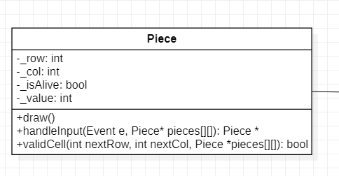

# Đồ án cuối kỳ OOP

## I. Mục tiêu

Làm một game đánh cờ đơn giản.

## II. Tính năng

Cho phép 2 người có thể chơi cờ vua với nhau. Hỗ trợ một số tính năng cơ bản của cờ vua như: Đồng hồ, tính điểm, ghi lại các nước đi trong trận đấu, ...

## III. Các class được sử dụng

### Piece

Đây là đối tượng quân cờ, gồm một số đặc tính cơ bản sau:

- `int _row, _col`: Tọa độ (Chỉ số dòng và cột) của quân cờ hiện tại.
- `bool _isWhite`: Để chỉ đây là quân cờ của bên trắng hay bên đen.
- `bool _isAlive`: Để chỉ quân cờ này đã bị quân của đối phương ăn hay chưa.
- `int _value`: Giá trị mà đối phương sẽ nhận được khi ăn quân cờ này (Tốt = 1, Mã = 3, Tượng = 3, Xe = 5, Hậu = 9, Vua = `INF`).

Class này sẽ bao gồm các hàm chức năng sau:

- `void draw()`: Vẽ quân cờ hiện tại, hàm này được gọi ở mỗi khung hình (frame).
- `Piece *handleInput(Event e, Piece *pieces[][])`: Hàm này nhận vào một sự kiện (event) `e` - ở đây là có thể hiểu là tương tác của người dùng với trò chơi và trạng thái hiện tại của bàn cờ. Hàm này sẽ xử lý tương tác của người dùng và trả về trạng thái mới của quân cờ sau tương tác đấy.
- `bool validCell(int nextRow, int nextCol, Piece *pieces[][])`: Hàm nhận vào tọa độ đích và trạng thái của bàn cờ. Kết quả trả về cho biết quân cờ hiện tại có được phép di chuyển vào ô ở tọa độ đích hay không.

Các lớp cho các quân cờ khác như `Pawn, Knight, Rook, Bishop, Queen` và `King` sẽ kế thừa từ lớp `Piece` và nạp chồng hàm `validCell()`.

### Timer

Dùng để lưu trữ thông tin về thời gian còn lại của người chơi. Bao gồm các thuộc tính sau:

- `bool isActive`: Để cho biết đồng hồ này có đang chạy hay đang được tạm dừng.
- `float _remainingTime`: Thời gian hiện tại của đồng hồ.

Class này sẽ bao gồm một số hàm chức năng như sau:

- `void update()`: Được gọi ở mỗi khung hình, cập nhật trạng thái của đồng hồ.

### Record

Lưu lại lịch sự trận đấu. Gồm các thuộc tính:

- `int nTurns`: Lưu lại số lượt đi đến thời điểm hiện tại.
- `string *history`: Một mảng gồm các xâu để ghi lại thông tin các nước đi.

Class này gồm một số hàm chức năng:

- `addMoves(string str)`: Thêm nước đi `str` vào lịch sử trận đấu.
- `saveToFile(str path)`: Lưu lịch sự trận đấu vào tập tin.

### ChessGame

Dùng để lưu các trạng thái của trò chơi. Bao gồm các thuộc tính sau:

- `Piece *_pieces[8][8]`: Dùng để lưu trạng thái của bàn cờ, `pieces[i][j]` trỏ đến quân cờ được đặt ở hàng `i`, cột `j`. Trong trường hợp ô này rỗng thì trỏ về `NULL`.
- `Record record`: Lịch sự của trận đấu hiện tại.
- `bool _isWhiteTurn`: Dùng để cho biết lượt hiện tại là của người đi quân trắng hay người đi quân đen.
- `Timer _timer[2]`: Dùng để lưu thời gian còn lại của người đi quân trắng và người đi quân đen.
- `int _score[2]`: Dùng để lưu trữ điểm số của 2 người chơi (Tổng giá trị các quân ăn được).

Class này sẽ bao gồm một số hàm chức năng như sau:

- `void handelInput():` Xử lý tương tác với người dùng.
- `void draw()`: Vẽ toàn bộ các thông tin của trò chơi lên màn hình.
- `bool isCheckMate()`: Được gọi mỗi khi người chơi thực hiện một nước đi hợp lệ, kiểm tra xem nước đi vừa rồi có chiếu bí đối phương hay không.
- `bool isStaleMate():` Kiểm tra trường hợp hết nước đi (hòa).

### TextureManager

Để tối ưu hóa khả năng xử lý của CPU với các phép tính đồ họa, ta sẽ cần thêm một class để hỗ trợ các thao tác đọc ảnh từ bộ nhớ.
